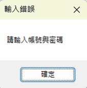
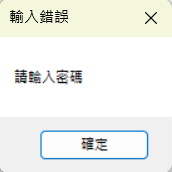

# BookkeepingAPP

**Download File to Your Computer**

```
git clone https://github.com/blog40813/BookkeepingAPP.git
```

<br>
下載完成 → 以Visual Studio程式開啟AccoutingAPP.sln

# 操作流程
### form1.cs 登入頁面
 * 首先，可以看到登入頁面，輸入帳號密碼

 <br>
 
 <br> 
 
  * 系統會自動偵測帳號密碼以及使用者是否存在，若不存在，詢問是否創建帳號
 <br>

`
下圖是幾個會出現的提示框
`
  




<br>


### form2.cs 程式頁面

* 可以選擇離開、新增、檢視
<br>


### form3.cs 新增頁面
* 可以選擇項目、輸入金額、備註，輸入完成跳出提示框<br>


### form4.cs 檢視頁面
* 左手邊是目前記帳裡面所有的紀錄以及金額總結，可以從右上角的combo box選擇你要查詢的項目<br>右手邊則是查詢的項目，可以藉由選擇右手邊方塊item將記錄刪除<br>


### exit 離開
* **注意！須利用正常按鈕離開程式，記錄才會儲存，否則資料會遺失**
<br>

